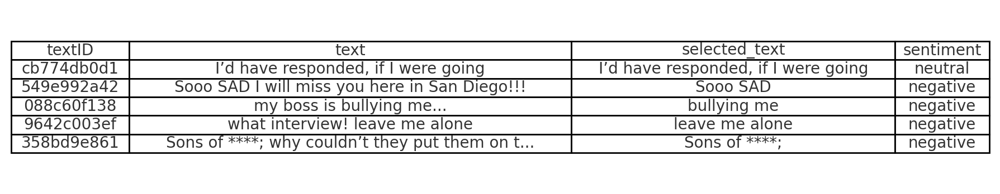
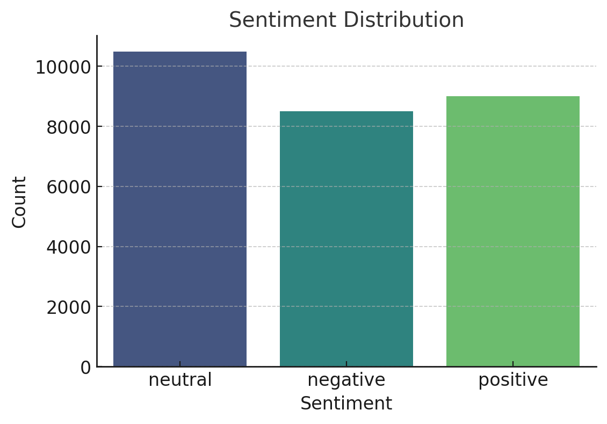
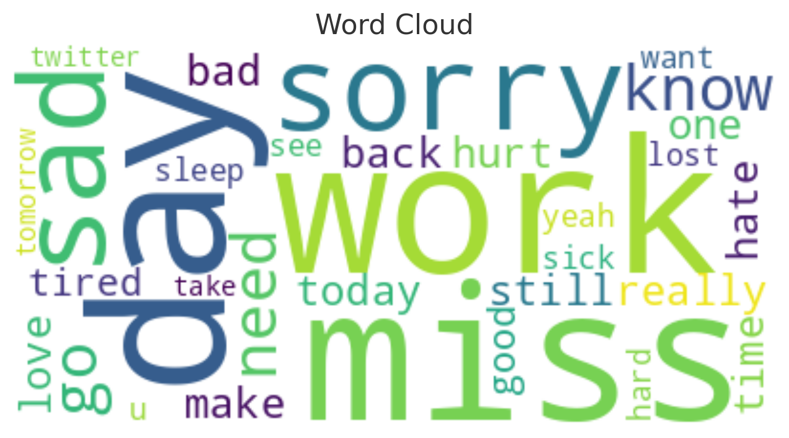
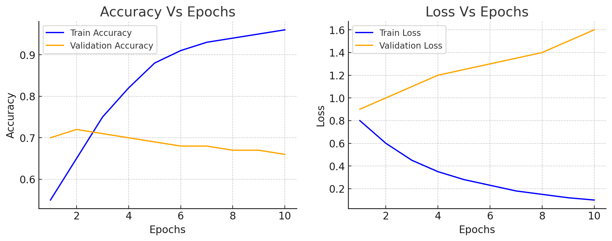

# Sentiment-Analysis-on-Twitter-using-NLP
In this project, we will learn how to analyze sentiments on Twitter by focusing on a dataset containing more than 100,000 opinions about COVID-19 from users worldwide.
Sentiment analysis is crucial for understanding public opinion, especially on platforms like Twitter, where diverse views are shared. In this project, we'll analyze sentiments about COVID-19 using a dataset of over 100,000 tweets worldwide. We'll leverage Python, along with libraries like pandas and NLTK, to process raw Twitter data into a structured format suitable for analysis. Additionally, we'll explore the VADER sentiment analysis tool tailored for social media language. By project end, we'll adeptly analyze global COVID-19 sentiments and effectively visualize the data, offering valuable skills for both beginners and those seeking to enhance their natural language processing abilities.


Analyzing user sentiment through tweets and comments can be invaluable for companies, especially during product launches. By understanding customer behavior and feedback through sentiment analysis, businesses can make informed decisions, address customer concerns, and implement targeted improvements. This approach can enhance customer satisfaction and ultimately improve revenue.


---

## **Approach Overview**

### **1. Machine Learning and Data Science**
Using machine learning techniques, the sentiment of text is predicted as positive, negative, or neutral. Key steps include:
- **Text Analysis**: Breaking down input text into meaningful components.
- **Deep Learning Models**: Leveraging deep neural networks for accurate predictions.
- **Prediction Output**: Analyzing the results to determine the overall sentiment.

### **2. Natural Language Processing (NLP)**
Natural Language Processing (NLP) is essential for:
- **Vectorizing Text**: Converting words into numerical representations (mathematical vectors).
- **Enhancing Predictions**: Using these vectors with machine learning models for better accuracy.
- **Feature Engineering**: Including newly created features along with textual attributes to improve results.

### **3. Vectorizers**
Text is transformed into a mathematical format using vectorizers, which are vital for machine learning models:
- **Count Vectorizer**: Counts word occurrences.
- **Tfidf Vectorizer**: Weighs word importance based on frequency.

---

## **Machine Learning Model**

### **Deep Neural Networks**
This project employs a deep neural network to predict the sentiment of tweets, ensuring robust and reliable results.

---

## **Exploratory Data Analysis (EDA)**

### **Dataset Overview**
- **Features**: Includes a dataframe where the 'text' feature serves as input and 'sentiment' as the target variable.
- **Goal**: Predict whether the sentiment of the text is positive, negative, or neutral.



### **Sentiment Distribution**
The majority of texts in the dataset are classified as neutral sentiment, with fewer texts being positive or negative.

**Visualization**:
- **Countplot**: Highlights the higher prevalence of neutral sentiments.



### **Wordcloud Representations**
- **Positive Sentiment**: Common words like "thank," "awesome," and "great" dominate.
- **Negative Sentiment**: Frequent words include "hate," "sorry," and "sad."


---

## **Hyperparameter Tuning**

After selecting appropriate machine learning models, hyperparameter tuning is conducted to:
- Optimize model performance.
- Understand the impact of different hyperparameters on model outcomes.
- Apply the fine-tuned models in production environments for maximum effectiveness.

---

## **Results**

### Key Insights:
- **Overfitting**: The model shows a discrepancy between training and test losses, indicating overfitting.
- **Generalization**: Despite overfitting, the model demonstrates potential to generalize well on unseen test data.


---

## **Repository Setup Instructions**

### **1. Download Git**
Download Git from [this link](https://git-scm.com/downloads) to clone repositories.

### **2. Clone the Repository**
- Open the folder where you'd like to download the repository.
- Right-click and select **Gitbash Here**.
- In the terminal, use the following command:
  ```bash
  git clone <repository-link>

### **3. Open Jupyter Notebook**
- Use Anaconda Prompt to navigate to the folder containing the repository.
- Launch the Jupyter notebook
  ```bash
  jupyter notebook
- Open the .ipynb files to view and run the code.

# Visuals

## 1. Sentiment Distribution Countplot
The countplot below illustrates that the majority of texts in the dataset are neutral, with fewer positive and negative texts.

---

## 2. Wordcloud for Positive Sentiments
The wordcloud below shows the most frequent words in positive tweets. Words like "thank," "awesome," and "great" dominate.

---

## 3. Wordcloud for Negative Sentiments
The wordcloud below highlights negative tweets. Common words include "hate," "sorry," and "sad."

---

## 4. Hyperparameter Tuning Results
Hyperparameter tuning ensures the best possible performance for each machine learning model. It optimizes accuracy and demonstrates the influence of hyperparameters.

